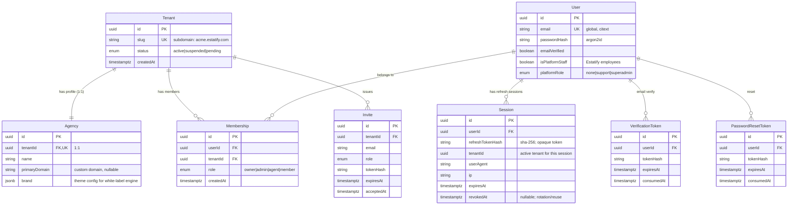

# Milestone 2 — Authentication & Multi-Tenancy (Plan)

Status: **Proposed — awaiting approval to implement**
Depends on: Milestone 1 foundation (Nx, apps, packages, RLS decision D5, ADR-008 security seams)
Last updated: 2026-07-13

> Goal (from sprint): _every customer has an isolated workspace._ Exit criteria:
> (1) users can securely sign in, (2) every request resolves to the correct
> tenant, (3) no tenant can access another tenant's data.

This plan implements the security seams that `ARCHITECTURE.md` deliberately
placed but did not build (ADR-003b RLS, ADR-008 auth homes). It does not
re-decide isolation strategy, ORM, or app topology — those are locked.

---

## 0. Decisions locked for this milestone

| #     | Decision          | Choice                                                                                                   | Rationale                                                                                                                                  |
| ----- | ----------------- | -------------------------------------------------------------------------------------------------------- | ------------------------------------------------------------------------------------------------------------------------------------------ |
| M2-D1 | Tenant ↔ Agency   | **1:1** — the Tenant _is_ the Agency                                                                     | Tenant = RLS isolation + billing boundary; `Agency` row holds brand/profile/domain. Matches the "100k agencies" scale framing.             |
| M2-D2 | Auth build vs buy | **In-house** — NestJS + Passport + `@nestjs/jwt`                                                         | Satisfies every deliverable literally; no vendor cost/lock-in. We accept the security-ownership burden (§10 risks).                        |
| M2-D3 | Password hashing  | **argon2id** (`argon2`), per-hash salt, tuned params                                                     | OWASP-preferred; bcrypt is the fallback only if native build is a problem.                                                                 |
| M2-D4 | Token model       | **Short-lived access JWT + rotating refresh token**                                                      | Access = 15 min, stateless. Refresh = opaque, hashed at rest, single-use with rotation + reuse detection.                                  |
| M2-D5 | Token delivery    | Access JWT in memory (response body) · refresh in **httpOnly cookie** `Domain=.estatify.com`             | Subdomains (`workspace`/`platform` → `api`) are same-site, so `SameSite=Lax` cookies flow on XHR. No access token in `localStorage` (XSS). |
| M2-D6 | Tenant binding    | JWT carries `tid` (active tenant); Nest `TenantGuard` sets Postgres GUC `app.current_tenant` per request | RLS is the primary control; app-level `where tenantId` is defense-in-depth.                                                                |
| M2-D7 | Email transport   | Provider-agnostic `MailPort` interface; dev = Mailhog, prod = pluggable (SendGrid/Resend)                | Removes provider choice from the critical path; swap at deploy time.                                                                       |

Items flagged **CONFIRM** in §9 are defaults I chose — veto before I build.

---

## 1. Scope boundary (what this milestone does and does NOT touch)

**In scope:** registration (new-agency signup), login, email verification,
forgot/reset password, tenant creation, agency creation, user roles (RBAC),
JWT auth, session management, tenant middleware (API + frontends), protected
routes (workspace + platform). Cross-tenant isolation tests.

**Explicitly out of scope (later milestones):** the public `sites` runtime auth
(those are anonymous visitors; host→tenant resolution already exists in
`apps/sites/middleware.ts` and is read-only), billing/Stripe, SSO/SAML, MFA/TOTP,
org-with-many-agencies (M2-D1 defers it), template marketplace. MFA and SSO seams
are _placed_ (§3 schema leaves room) but not implemented.

---

## 2. Data model (Prisma — `packages/database`)

`Tenant` is the isolation root. Every tenant-scoped table carries `tenantId` and
gets an RLS policy. Identity tables (`User`, and the token tables) are **global**
(a user authenticates before a tenant is known), while `Membership` binds a user
to a tenant with a role.



Key modeling choices:

- **`Membership` is a join table** even though M2-D1 is 1:1 tenant↔agency. A user
  _belongs to_ a tenant via membership so multi-tenant membership and invites are
  additive later — no rewrite. For MVP most users have exactly one membership.
- **Uniqueness:** `User.email` is globally unique (citext). `Invite` unique on
  `(tenantId, email)` where unaccepted.
- **RLS applies to** `Agency`, `Membership`, `Invite`, and every future
  tenant-scoped table (`Property`, `Lead`, …). `User`, `Session`, and token
  tables are global and protected by application logic + ownership checks, not RLS.
- **Token tables store only a hash** of the emailed/cookie token; the raw value
  lives only in the email link or cookie. Single-use via `consumedAt`.

RLS migration (hand-written SQL alongside Prisma migrations, since Prisma doesn't
model policies):

```sql
ALTER TABLE "Agency"     ENABLE ROW LEVEL SECURITY;
ALTER TABLE "Membership" ENABLE ROW LEVEL SECURITY;
CREATE POLICY tenant_isolation ON "Agency"
  USING ("tenantId" = current_setting('app.current_tenant', true)::uuid);
-- current_setting(…, true) => returns NULL instead of erroring when unset,
-- so unauthenticated/global queries simply match no tenant-scoped rows.
```

---

## 3. Auth flows

### 3a. Registration (new agency signup) — the primary path

```
POST /auth/register { email, password, agencyName, slug }
  → validate (zod) · check email + slug free
  → argon2id(password)
  → ONE transaction: create User + Tenant + Agency + Membership(role=owner)
  → issue VerificationToken → MailPort.sendVerifyEmail(link)
  → 201 { userId } (NOT logged in yet — must verify first *or* allow
     unverified login with a gated state; see CONFIRM-1)
```

Transaction is all-or-nothing: a half-created tenant is never persisted.

### 3b. Email verification

```
GET /auth/verify?token=…  → hash · lookup · check TTL/consumed · mark verified · consume
```

### 3c. Login

```
POST /auth/login { email, password }
  → rate-limited (per IP + per account; §7)
  → argon2.verify (constant-time; same error for bad-user vs bad-pass)
  → resolve active tenant (single membership → that tenant; multiple → pick default)
  → issue access JWT { sub, tid, role } + refresh Session
  → set refresh httpOnly cookie · return access token in body
```

### 3d. Refresh (rotation + reuse detection)

```
POST /auth/refresh  (refresh cookie)
  → hash cookie · find Session · if revoked/expired → 401 + revoke whole family
  → rotate: revoke old, issue new refresh (new cookie) + new access JWT
```

Reuse of an already-rotated token ⇒ token theft ⇒ revoke the user's whole session
family and force re-login.

### 3e. Forgot / reset password

```
POST /auth/forgot { email }  → ALWAYS 200 (no account enumeration);
     if user exists → issue PasswordResetToken → email link
POST /auth/reset  { token, newPassword }
     → hash/lookup/TTL/consume · argon2 rehash · revoke ALL sessions · consume token
```

### 3f. Logout

```
POST /auth/logout → revoke current Session · clear cookie
```

---

## 4. Tenant resolution & RLS enforcement (exit criteria 2 & 3)

This is the load-bearing part of the milestone.

1. `JwtAuthGuard` validates the access JWT → attaches `req.user = { sub, tid, role }`.
2. `TenantGuard` reads `tid`, verifies the user still has an active membership in
   that tenant (cheap cached check), attaches `req.tenantId`.
3. A **per-request Prisma transaction** runs `SET LOCAL app.current_tenant = $tid`
   before any query. Because Prisma pools connections, the GUC **must** be
   `SET LOCAL` inside a transaction — never a bare `SET` on a pooled connection
   (that would leak a tenant into the next request). This is the #1 correctness
   trap and gets a dedicated test.

```ts
// packages/database — tenant-scoped client factory (sketch)
export function forTenant(tenantId: string) {
  return prisma.$extends({
    query: {
      $allModels: {
        async $allOperations({ args, query }) {
          return prisma.$transaction(async (tx) => {
            await tx.$executeRawUnsafe(
              `SELECT set_config('app.current_tenant', $1, true)`,
              tenantId,
            );
            return query(args);
          });
        },
      },
    },
  });
}
```

4. RLS guarantees isolation **even if step 3's `where` is forgotten** — app code
   is defense-in-depth, the DB policy is the control. Switching tenants requires a
   new token (§3d re-issues with a different `tid`).

**Frontend tenant context:** `workspace`/`platform` never set tenant from user
input. The active tenant comes from the validated session; `packages/providers`
exposes a `TenantProvider` hydrated from `/auth/me`.

---

## 5. RBAC (user roles)

Two role spaces, never mixed:

- **Tenant roles** (on `Membership`): `owner` › `admin` › `agent` › `member`.
  Enforced by a Nest `@Roles()` decorator + `RolesGuard` reading `req.user.role`.
- **Platform roles** (on `User`, for Estatify staff in `apps/platform`):
  `superadmin`, `support`. Platform staff bypass tenant RLS via an explicit,
  audited service path — never by ambient privilege.

Client-side, `packages/auth` exports `hasRole(user, 'admin')` and a `<RequireRole>`
guard for conditional UI — cosmetic only; the API is the real enforcement point.

---

## 6. Protected routes

**Backend (`apps/api`):** guards registered **globally**, opt-out via `@Public()`.
Order: `JwtAuthGuard` → `TenantGuard` → `RolesGuard`. Public endpoints:
`/auth/register|login|forgot|reset|verify|refresh`, health.

**Frontend (`apps/workspace`, `apps/platform`):** Next.js 16 `proxy.ts` uses shared
`protectRoutes` from `@estatify/auth`. It validates the refresh cookie via
`POST /auth/refresh`, redirects unauthenticated users to `/sign-in` (workspace) or
`/login` (platform), redirects authenticated users away from guest-only routes to
`/dashboard`, and enforces role seams (customers ↔ workspace, staff ↔ platform).
Server Components read the user from proxy-injected headers; no flash of protected content.

---

## 7. Cross-cutting security

Rate limiting (`@nestjs/throttler`) on `login`/`forgot`/`register` per IP + per
account; account soft-lockout after N failures. Uniform error messages (no user
enumeration on login/forgot). CSRF: refresh endpoint is cookie-auth → double-submit
CSRF token; all other endpoints are bearer-auth (immune). Secrets via
`packages/config` zod schema (JWT keys, cookie domain, mail keys) — fail-fast at
boot. Access JWT signed with rotating key id (`kid`) to allow key rotation.

---

## 8. Work breakdown & file map (phased, each phase has an exit gate)

| Phase                    | Deliverables                                                                              | Where                                                        | Exit gate                                                     |
| ------------------------ | ----------------------------------------------------------------------------------------- | ------------------------------------------------------------ | ------------------------------------------------------------- |
| **P0 Infra**             | docker-compose: Postgres + Redis + Mailhog; Prisma init; env schema                       | `packages/config`, `packages/database`, root                 | `pnpm dev:api` boots; `prisma migrate dev` green              |
| **P1 Schema + RLS**      | Models §2, RLS migration, `forTenant` client, seed                                        | `packages/database`                                          | Isolation unit test: tenant A cannot read tenant B row        |
| **P2 Contracts**         | zod DTOs + shared types (Register/Login/Reset/JWT payload/roles)                          | `packages/types`                                             | Imported by both api + a frontend form; typecheck green       |
| **P3 API auth core**     | Auth module, Passport strategies, JWT, argon2, guards, MailPort                           | `apps/api`, `packages/config`                                | `login`→`refresh`→`logout` e2e passes                         |
| **P4 API tenancy**       | TenantGuard + GUC transaction, RolesGuard, register→create tenant+agency                  | `apps/api`, `packages/database`                              | Every authed request carries correct tenant; RLS negative e2e |
| **P5 Email flows**       | verify + forgot + reset endpoints and emails                                              | `apps/api`                                                   | Mailhog receives links; full reset cycle works                |
| **P6 Client data layer** | `useLogin/useRegister/useMe`, refresh interceptor, SessionProvider/TenantProvider         | `packages/api-client`, `packages/auth`, `packages/providers` | Silent refresh on 401 works                                   |
| **P7 Workspace UI**      | (auth) pages: login/register/verify/forgot/reset; protected (dashboard) shell; middleware | `apps/workspace`                                             | Manual + Playwright happy-path green                          |
| **P8 Platform UI**       | staff login, protected admin shell, tenant list (read)                                    | `apps/platform`, `packages/feature-tenant-admin`             | Staff-only gate enforced                                      |
| **P9 Hardening + tests** | rate limit, lockout, CSRF, isolation suite, lint/typecheck/build                          | all                                                          | §11 exit-criteria suite green in CI                           |

Boundary compliance (ADR-006): `apps/*` frontends import `@estatify/api-client`
/`auth`/`providers` only — never `@estatify/database`. `packages/database` stays
`scope:api`. CI lint fails on violation.

---

## 9. Defaults I chose — CONFIRM or veto

- **CONFIRM-1 — Unverified login policy.** Default: allow login but return a
  `verificationRequired` state that gates sensitive actions, with a resend option.
  Alternative: hard-block login until verified. (Softer default = better activation;
  stricter = simpler.)
- **CONFIRM-2 — Signup model.** Default: **self-serve** — anyone can register an
  agency and pick a `slug`. Alternative: invite-only / waitlisted.
- **CONFIRM-3 — Role taxonomy.** Default `owner/admin/agent/member` (§5). Tell me
  if real-estate ops need different names (e.g., `broker`, `team-lead`).
- **CONFIRM-4 — Prod email provider.** Default interface + Mailhog for dev; I'll
  wire **SendGrid** for prod (its skills are already in your workspace) unless you
  prefer Resend/SES.
- **CONFIRM-5 — Access/refresh TTLs.** Default 15 min / 30 days rolling. Adjust for
  your risk tolerance.

---

## 10. Risks (ruthless)

1. **We now own auth security.** Rotation, reuse detection, lockout, and breach
   response are ours. Mitigation: lean on `@nestjs/passport` + `argon2` +
   `@nestjs/throttler` (battle-tested), keep the custom surface small, and treat
   the §11 test suite as non-negotiable before any real user data lands.
2. **Prisma + RLS pooling trap (§4).** A bare `SET` leaks tenants across pooled
   connections. Mitigation: `SET LOCAL` in a per-request transaction + an explicit
   test that hammers concurrent requests across two tenants on the same pool.
3. **Global identity vs tenant-scoped data seam.** `User`/`Session` are global;
   getting the boundary wrong risks either leaking users across tenants or blocking
   legitimate multi-tenant membership. Mitigation: membership is the _only_ bridge;
   no `tenantId` on `User`.
4. **Cookie domain across subdomains.** Misconfigured `Domain`/`SameSite` silently
   breaks refresh in prod while working on localhost. Mitigation: config-driven
   cookie domain, tested against a real subdomain preview before launch.
5. **Platform-staff bypass** of RLS is a deliberate hole. Mitigation: a single
   audited service path, never ambient — and it is itself tested for scope creep.

---

## 11. Exit-criteria verification (the tests that close the sprint)

1. **"Users can securely sign in."** e2e: register → verify → login → access
   protected route → refresh → logout. Assert argon2 hashing, no plaintext,
   rate-limit + lockout trip, uniform errors (no enumeration).
2. **"Every request resolves to the correct tenant."** Integration: authed request
   with tenant A's token sees only A's data; `app.current_tenant` GUC asserted set
   per request; concurrent A/B requests on one pool never cross.
3. **"No tenant can access another tenant's data."** The headline suite: as tenant
   A, attempt read/write of tenant B's `Agency`/`Membership`/seeded `Property` by
   id → RLS returns zero rows / 403. Repeat with app-level `where` deliberately
   removed to prove **RLS alone** blocks it. Cross-tenant token replay rejected.

All of the above run in the P9 gate and wire into the existing CI
(`nx affected -t test`).

---

## 12. First implementation step (on approval)

P0: add `docker-compose.yml` (Postgres 16 + Redis + Mailhog), initialize Prisma in
`packages/database`, extend `packages/config` env schema with the auth/cookie/mail
vars, and land the §2 schema + RLS migration. Nothing in P1+ starts until
`prisma migrate dev` is green and the first isolation unit test passes.
